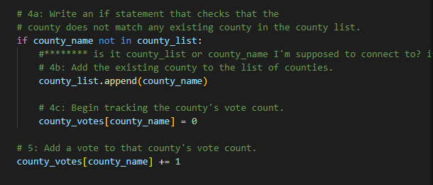
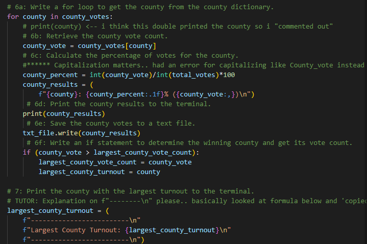

# Election_Analysis

## Overview of Election Audit

### Purpose
In this project we wanted to help Seth and Tom submit the election audit results to the election commission. They had specific deliverables they were looking for including an output of a txt file explaining the following. 

1. Get the total number of votes cast.
2. Show the complete list of candidates who received votes
3. Calculate total number of votes each candidate received.
4. Calculate percentage of votes that each candidate won. 
5. Determine winner of the election based on popular vote
6. Show voter turnout for each county.
7. Show percentage of votes from each county out of the total count. 
8. Show county with the highest voter turnout.

## Election Audit Results
Based on the election results:
* There were a total of 369,711 votes cast in the election. 
* The County voting results were as follows:
    * Jefferson County was responsible for 10.5% of the votes which was 38,855 votes total.
    * Denver County was responsible for 82.8% of the votes which was 306,055 votes total.
    * Arapahoe County was responsible for 6.7% of the votes which was 24,801 votes total.

* Denver County had the largest number of votes with 306,055 votes.

* The Candidate results were as follows:
    * Charles Casper Stockham received 23.0% of the vote for a total of 85,213 votes.
    * Diana DeGette received 73.8% of the vote for a total of 272,892 votes.
    * Raymon Anthony Doane received 3.1% of the vote for a total of 11,606 votes.
* Which county had the largest number of votes?
Diana DeGette won the election with a total of 272,892 votes which turned out to be 73.8% of the total votes.

## Election Audit Summary

The Python code for the Election Audit can be used for any election. 

This Python script can be modified to add a state column if you are looking for a solution for a national election. If you didn't need county information, you could look to replace the county code with 'state' code.


This election is decided by popular vote. If the next election that you would advise decides the winner based on the electoral college or number of counties won, you could easily modify the code to track counties won. 

```python
if (county_vote > largest_county_vote_count):
            largest_county_vote_count = county_vote
            largest_county_turnout = county
```
 
